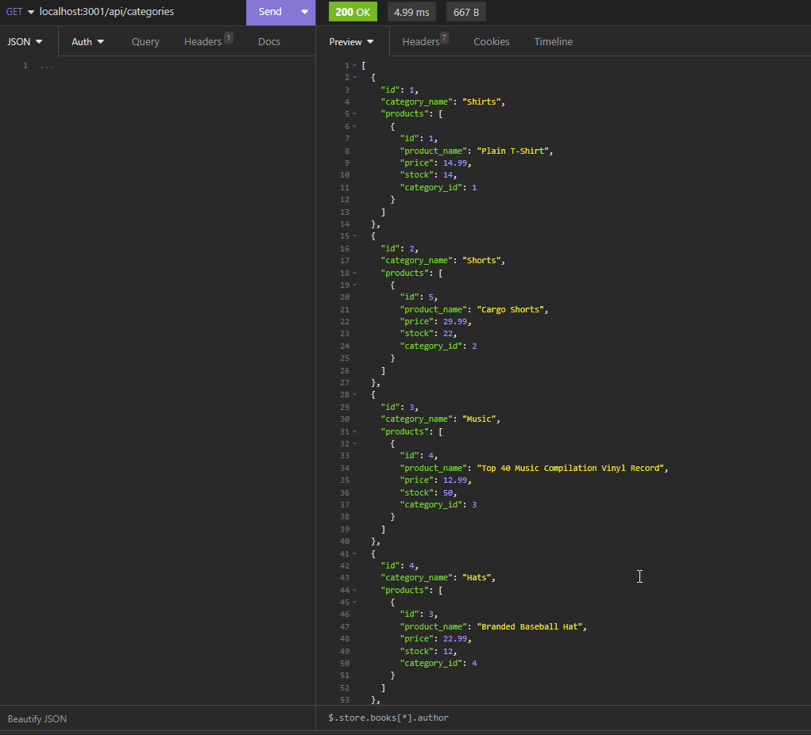

# E-Commerce-Back-End

## Link to application 
https://github.com/Seanye333/E-Commerce-Back-End

## Video Tutorial 
https://watch.screencastify.com/v/vMplBC1A6x1ihQvG0KoT

## Description

Internet retail, also known as **e-commerce**, plays a significant role within the electronics industry, as it empowers businesses and consumers alike to conveniently engage in online buying and selling of electronic products. In the latest available data from 2021, the industry in the United States alone was estimated to have generated the substantial amount of US$2.54 trillion, according to the United Nations Conference on Trade and Development. E-commerce platforms like Shopify and WooCommerce provide a suite of services to businesses of all sizes. Due to the prevalence of these platforms, developers should understand the fundamental architecture of e-commerce sites.

This code is to build the back end for an e-commerce site by modifying starter code and configure a working Express.js API to use Sequelize to interact with a MySQL database.



## Installation
To install this project within your computer, please follow the instruction below
1. Open git bash
2. Create your own file
3. To clone the repository: type in git clone https://github.com/Seanye333/E-Commerce-Back-End
4. Use cd to navigate to db path /db 
5. Input mysql -u root -p to command line 
6. Input Source schema.sql 
7. Input source seeds.sql
8. ctrl and z to exit sql 
9. cd to Develop path 
10. Input "npm run seed" to command line 
11. Input npm start 


## Usage
Please download the files from my github page and feel free to use it without any cost. 


## Credits
https://www.npmjs.com/package/mysql2
https://www.npmjs.com/package/dotenv

## License
This project is licensed under the MIT License.

## Features
Following features are from original acceptance criteria from the project: 
```
GIVEN a functional Express.js API
WHEN I add my database name, MySQL username, and MySQL password to an environment variable file
THEN I am able to connect to a database using Sequelize
WHEN I enter schema and seed commands
THEN a development database is created and is seeded with test data
WHEN I enter the command to invoke the application
THEN my server is started and the Sequelize models are synced to the MySQL database
WHEN I open API GET routes in Insomnia for categories, products, or tags
THEN the data for each of these routes is displayed in a formatted JSON
WHEN I test API POST, PUT, and DELETE routes in Insomnia
THEN I am able to successfully create, update, and delete data in my database
```

## How to Contribute
Contributions to this project are not avaiable currently.
